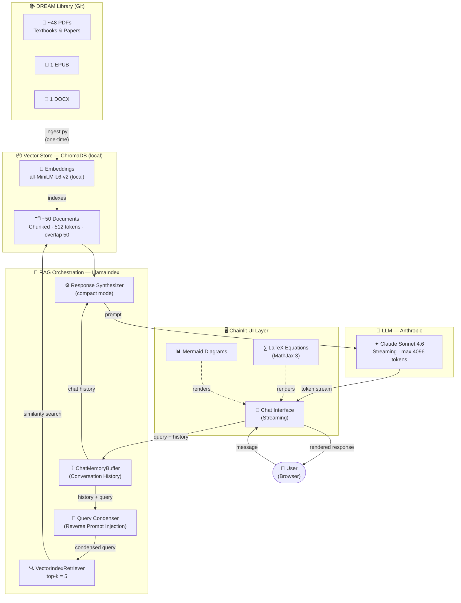
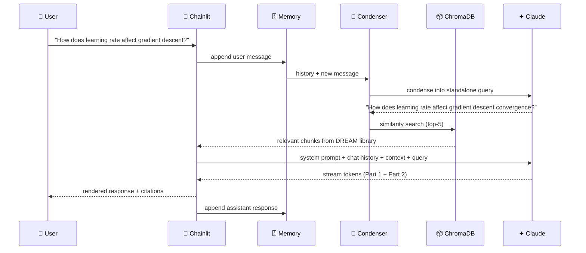

# conquest.ai

> AI-powered research assistant for Data Science, Machine Learning, and AI


conquest.ai combines **Claude Sonnet 4.6** with **Retrieval-Augmented Generation** over the DREAM library — a curated collection of DS/ML/AI textbooks and research papers — to give rigorous, two-part answers with LaTeX equations, Mermaid diagrams, and conversation memory.

---

## Architecture



### Data Flow



---

## Tech Stack

| Layer | Technology | Role |
|---|---|---|
|  | Chainlit ≥ 1.3 | Chat UI — LaTeX, Mermaid, streaming |
|  | Claude Sonnet 4.6 | LLM — reasoning, math, code generation |
|  | LlamaIndex ≥ 0.11 | RAG orchestration + chat memory |
|  | ChromaDB ≥ 0.5 | Local persistent vector store |
|  | sentence-transformers | Local embeddings — no API needed |
|  | PyMuPDF (fitz) | PDF parsing — best for math symbols |
| | ebooklib + BS4 | EPUB parsing |
| | python-docx | DOCX parsing |

---

## Key Features

- **Two-part responses** — every answer starts with a technical definition + intuition (Part 1), followed by a full mathematical/statistical deep-dive with LaTeX equations (Part 2)
- **Conversation memory** — the chat engine remembers the full session; ask follow-up questions naturally
- **Reverse prompt injection** — prior conversation turns are condensed back into each new retrieval query, keeping context coherent across multi-turn sessions
- **DREAM library RAG** — responses are grounded in curated textbooks and research papers
- **Local embeddings** — `all-MiniLM-L6-v2` runs fully offline; only the LLM call uses the API

---

## Project Structure

```
conquest.ai/
├── README.md                    ← This file
├── .env.example                 ← API key template (copy to .env)
├── .gitignore
├── requirements.txt
├── chainlit.md                  ← Chatbot welcome screen
├── app.py                       ← Chainlit app (main entry point)
├── ingest.py                    ← Document ingestion script (run once)
├── src/
│   ├── prompts.py               ← System prompt, two-part format, LaTeX rules
│   ├── indexer.py               ← PDF/EPUB/DOCX loading, chunking, ChromaDB
│   └── rag.py                   ← CondensePlusContextChatEngine + streaming
├── .chainlit/
│   └── config.toml              ← LaTeX enabled, assistant name set
├── data/
│   └── chroma_db/               ← ChromaDB vector store (auto-created)
└── DREAM/                       ← DREAM library (cloned by ingest.py, gitignored)
```

---

## Setup

**Prerequisites:** Python 3.11+, Git, [Anthropic API key](https://console.anthropic.com)

```bash
# 1. Install dependencies
pip install -r requirements.txt

# 2. Configure API key
cp .env.example .env
# Edit .env → set ANTHROPIC_API_KEY=sk-ant-...

# 3. Build the knowledge base (first time only — clones ~400MB DREAM library)
python ingest.py

# 4. Start the chatbot
chainlit run app.py
# Open http://localhost:8000
```

**Re-index after adding documents:**
```bash
python ingest.py --force
```

---

## Example Queries

```
Explain gradient boosting with equations
```
```
What is the LASSO objective function and why does it produce sparse solutions?
```
```
Show me a diagram of the neural network training pipeline
```
```
How does k-means++ initialization improve over random initialization?
```
```
What are the bias-variance tradeoff implications for Random Forests?
```

---

## Configuration

| Variable | Default | Description |
|---|---|---|
| `ANTHROPIC_API_KEY` | *(required)* | Anthropic API key |
| `CONQUEST_MODEL` | `claude-sonnet-4-6` | Claude model ID |
| `CHROMA_DB_PATH` | `./data/chroma_db` | ChromaDB storage path |
| `DREAM_PATH` | `./DREAM` | DREAM library path |

---

## DREAM Library

**DREAM** *(Data Science, Research, and Engineering Artifacts for Machine Learning)*
— [github.com/Indranil-Seal/DREAM](https://github.com/Indranil-Seal/DREAM)

~50 files · ~400 MB · Topics: ML algorithms, statistics, deep learning, Python/R, domain applications
